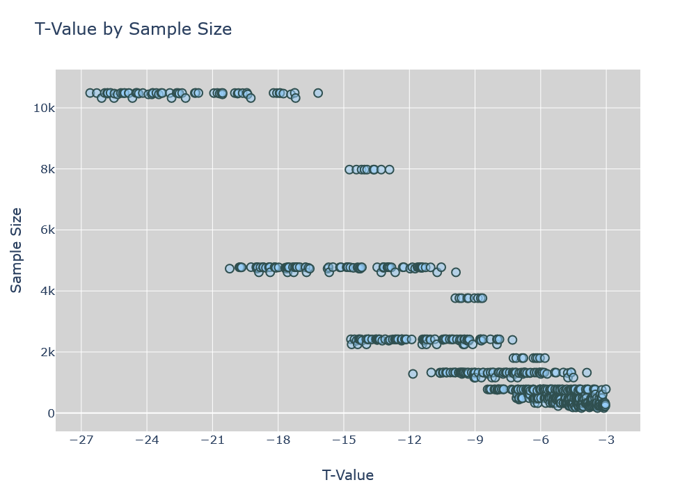
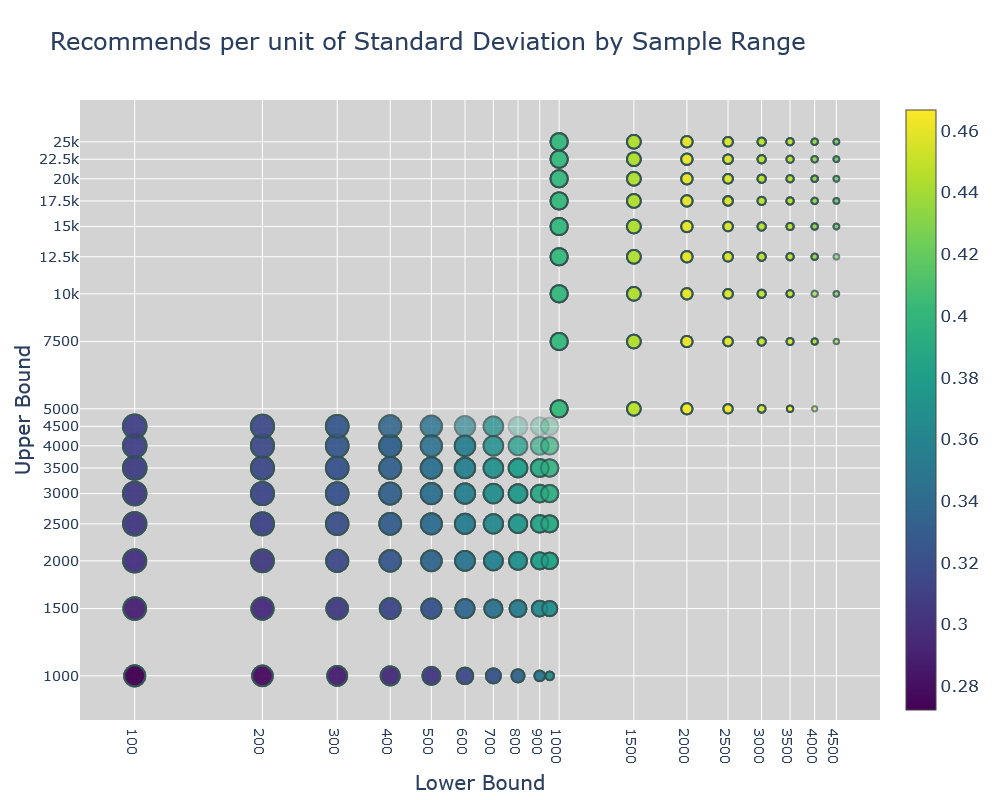

# Medium Article Word Count Analysis (<a href="https://nbviewer.jupyter.org/github/zavonn/Medium_Post_Analysis/blob/master/MediumPostAnalysis.ipynb">Interactive Jupyter Notebook available Here</a>)

Recently I stumbled upon the <a href="https://www.kaggle.com/aiswaryaramachandran/medium-articles-with-content">Medium Articles (with Content)</a> Kaggle Dataset. This dataset includes all articles on Medium with the tags AI, Machine Learning, Datascience or Artificial Intelligence. The posts were scraped from September 2017 to September 2018, and in total, over 72,000 articles, first published between 2010 and 2018 are included in the collection.

The first question that sprang to mind while I was exploring the dataset was whether or not word count had an impact on the overall number of recommends? 'Recommends' in this context, refers to the number of unique readers that have 'clapped' for an article. If an author could save time by knowing the optimal word count for their post, both Medium and the individual would benefit.

I hypothesized that if great articles did not receive the maximum amount of ‘recommends’ because they were too long, they would be less likely to be recommended and read by the maximum number of readers. The organization (Medium) would then receive less traffic and lose the accompanying business benefits because their content delivery was not optimized.

Of the original 50 columns listed below, I selected 17 attributes that presented unique, relevant information to begin my analysis.

Index(['audioVersionDurationSec', 'codeBlock', 'codeBlockCount',
       'collectionId', 'createdDate', 'createdDatetime', 'firstPublishedDate',
       'firstPublishedDatetime', 'imageCount', 'isSubscriptionLocked',
       'language', 'latestPublishedDate', 'latestPublishedDatetime',
       'linksCount', 'postId', 'readingTime', 'recommends',
       'responsesCreatedCount', 'socialRecommendsCount', 'subTitle',
       'tagsCount', 'text', 'title', 'totalClapCount', 'uniqueSlug',
       'updatedDate', 'updatedDatetime', 'url', 'vote', 'wordCount',
       'publicationdescription', 'publicationdomain',
       'publicationfacebookPageName', 'publicationfollowerCount',
       'publicationname', 'publicationpublicEmail', 'publicationslug',
       'publicationtags', 'publicationtwitterUsername', 'tag_name', 'slug',
       'name', 'postCount', 'author', 'bio', 'userId', 'userName',
       'usersFollowedByCount', 'usersFollowedCount', 'scrappedDate'],
      dtype='object')

The final columns selected: 

Index(['firstPublishedDatetime', 'imageCount', 'isSubscriptionLocked',
       'latestPublishedDatetime', 'linksCount', 'readingTime', 'recommends',
       'responsesCreatedCount', 'tagsCount', 'title', 'totalClapCount', 'url',
       'wordCount', 'publicationname', 'userName', 'usersFollowedByCount',
       'usersFollowedCount'],
      dtype='object')
      
Out of the final 17 columns, 10 were numerical, and 8 were relatively independent. Both 'Recommends' and 'Word Count,' were almost 100% correlated with 'totalClapCount' and 'readingTime' respectively.
 
A correlation matrix for all of the numerical columns shows some relationship (Correlation Coefficient > 30%) between Recommends and Word Count, Image Count, Responses Created Count, and Users Followed by Count.


After looking at the scatter plot of Recommends to Word Count for all of the 66,000 articles that remained out of the original 73,000; after non-english posts and 440 posts whose number of recommends varied over two standard deviations from the mean were dropped, I formulated my official hypothesis: 

#### Writing articles that are 2000 words or less will increase the average number of ‘recommends’ or unique users that ‘clap’ for an article.''


To test my hypothesis, all of the articles were divided into groups of 2000 words or less (data1) or over 2000 words (data2). Below are two charts that show the original count of articles within various word count bins and the subsequent count for the two groups. 


Once the dataset had been divided, a sample of 2500 was taken from each side and a t-test was conducted to determine the likelihood that any variance in the mean number of recommends was random. 

The Null Hypothesis (or alternate hypothesis) used for the t-test experiment was formulated as follows:

#### The length of Medium Articles does not impact the number of recommends (There is no statistically significant difference in the number of recommends between articles with 2000 words or less and those with over 2000 words).

I would only consider the results meaningful if the t-value was greater than 3 and the p-value was less than 0.5%. I chose three for the t-value threshhold because the dataset was fairly large and t-values tend to grow as the sample size increases, and the p-value threshhold was chosen to limit the probability that a result that supports the null hypothesis would occur by chance.

```python

under_2000 = data1.sample(2500)
over_2000 = data2.sample(2500)

y1 = np.mean(under_2000.recommends)
y2 = np.mean(over_2000.recommends)
s1 = np.std(under_2000.recommends)
s2 = np.std(over_2000.recommends)
n1 = 2500
n2 = 2500

t_value = (y1-y2) / np.sqrt(((s1**2) / n1) + ((s2**2) / n2))

from scipy import stats

stats.ttest_ind(under_2000.recommends, over_2000.recommends)

```
I calculated the t-test manually and via the scipy.stats package, and both results show that the sample mean number of recommends varied by over 14 standard deviations, which was well above the chosen threshhold for statistical significance.

Calculation Output:

```python

The mean number of Recommends for posts with 2000 words or less is 10.99
The mean number of Recommends for posts over 2000 words is 37.51
The standard deviation of Recommends for posts with 2000 words or less is 37.85
The standard deviation of Recommends for posts with over 2000 words is 82.65
The Sample Size for both groups is 2500

The T-value is -14.86512129303059

Ttest_indResult(statistic=-14.862147971410085, pvalue=6.3489346247111366e-49)

```

#### Based on these findings (T-Value of -14.8 and a P-Value of less than 0.5%), the Null Hypothesis should be rejected, and the mean number of recommends for the samples from the two groups of articles (over 2000 words and 2000 words or less) has been shown to be statistically different.

#### The negative t-value means articles with a word count over 2000 words are more likely to recieve a higher number of recommends, which implies my inititial instinct was incorrect as I did not expect articles of greater length to be more highly recommended. 

## Further Analysis

Although, the initial results were fairly conclusive, I wanted to explore additional subgroups of word counts to get a better understanding of their relationship with the number of Recommends. This time, I decided to iterate through a number of possible combinations.

I created subgroups with the following compositions to compare:

Lower Bound = [100,200,300,400,500,600,700,800,900,950]

Middle Bound = [1000,1500,2000,2500,3000,3500,4000,4500]

Upper Bound = [5000,7500,10000,12500,15000,17500,20000,22500,25000]

For example, one iteration would compare the mean number of recommends of articles with a word count between 100 and 1000 words with those of word counts from 1000 to 5000 words. 

Every iteration would produce a t-value and p-value, for a sample size of half of the smallest group amongst the two being compared. For example, if the 100 to 1000 word group only contained 1500 articles, and the 1000 word and above group contained 3000 articles, then the sample size would be set to 750.

In total, 720 combinations were compared, and once all entries with t-values less than 3 and sample sizes less than 100 were dropped to ensure statistical significance, 636 combinations remained. Out of the 636 combinations the greatest p-value was 0.26%, and the highest t-value was -3.02.

Using PyPlot, I created an interactive chart that shows the relationship between the sample size and t-values. Every statistically significant combination tested, resuled in a negative t-value, demonstrating the mean number of recommends was always higher for posts with a larger word count versus a smaller word count.



For a more granular perspective, I plotted the mean number of Recommends per unit of Standard Deviation for every subgroup tested. The mean and standard deviation of recommends was computed on the total number of articles within each subgroup and not for the sample size since I was not comparing two groups, but intended to provide insight into the actual results an author could expect within each range of word counts. In this chart, the Lower Bound is plotted on the X-Axis, the Upper Bound is plotted on the Y-Axis, the size of the bubble corresponds to the size of the subgroup (numer of articles within the lower and upper word count range), and the color represents the mean number of recommends per unit of standard deviation. According to the chart, the optimal number of words is between 2000 and 5000 words for this dataset.




### Cautionary Notes:

It is important to note that the results above may be a result of other unspecified factors. I would recommend conducting a controlled experiment that would mitigate other factors that may play a significant role. For example, although the top 3 publications were the same for the total dataset, and the initial subgroups of articles less than 2000 or over 2000 words, the subgroup with over 2000 words had almost twice the percentage of articles published in Towards Data Science and Hacker Noon. In addition, the mean number of usersFollowedByCount was 2400 for articles over 2000 words, while posts with 2000 or less words had an average follower count of 1650. ImageCount was twice as high, and LinksCount was 3 times as high for the over 2000 word group. The significance of these other factors has not been discussed in this analysis and should be studied further before any concrete examples are drawn; however, at this point all the data points to an optimal word count between 2000 and 5000 words, with more words being better than less for maximizing recommends on Medium.

## The full notebook contains the interactive Plotly Charts, which I highly recommend checking out. They can also be downloaded in html format from the Figures folder of this repository. The Jupyter Notebook 'Medium Post Analysis' contains all the specifics of the code used for this report. As always, feel free to reach out with any issues or if you would like clarification on any of the code! 


```python

```
